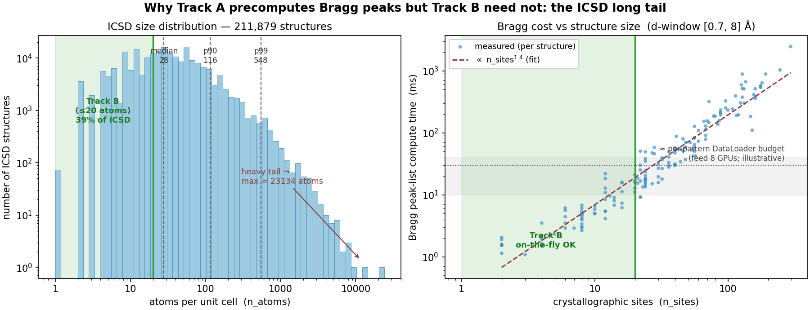

# CrystalAI — Design Decisions & Rationale

This document consolidates the rationale for the 8 core design commitments in `ROADMAP.md`. Each section states the decision, the alternatives considered, the reasoning chain, and the conditions under which the decision should be revisited.

The decisions are presented in order of *foundational dependency* — choices made earlier in the list constrain or motivate choices made later.

---

## 1. Encoder input coordinate: log(d-spacing)

**Decision.** All training and inference PXRD patterns are binned uniformly in log(d) over a fixed d-window: **d ∈ [0.7, 18] Å, 12,000 bins** (Δlog-d/bin ≈ 1.1×10⁻⁴). The wavelength is provided as an explicit input alongside the binned pattern. The window and bin count are set empirically (§1b); the earlier 0.7–8 Å / 4000-bin placeholder was too narrow (it truncated the first reflection of ~70% of ICSD) and too coarse (it undersampled the real 0.010° data).

**Alternatives considered.** Uniform binning in 2θ; uniform binning in linear d.

**Reasoning.**

PXRD patterns come from instruments using different X-ray wavelengths (Cu Kα, Mo Kα, Co Kα, synchrotron sources). The opXRD pool spans multiple sources, and our internal lab patterns use either Cu or Mo Kα on STADI-P / STADI-MP. Committing to 2θ implicitly commits to a fixed wavelength — forcing us to either discard non-Cu data, train separate models per wavelength, or hope wavelength-invariance is learned from a single-wavelength distribution. None are good options.

D-spacing is the wavelength-independent reciprocal of the diffraction vector (`d = λ / (2·sin θ)`) and is the natural coordinate for wavelength pooling. But d-space alone is insufficient: the smooth multiplicative modifiers — Lorentz-polarization (LP), Debye-Waller (DW), absorption — are wavelength-dependent even when intensities are placed correctly on a d-axis, because they were computed at a wavelength-specific 2θ angle before being baked into the integrated intensity. The same physical crystal therefore produces *different intensity envelopes in d-space* at different wavelengths. Without explicit wavelength conditioning, the model can exploit wavelength-specific envelope shapes as a shortcut.

**Why log-d, not linear-d.** Three independent advantages.

1. **Lattice scaling becomes a translation.** Two isostructural compounds (e.g., CeO₂, UO₂, ThO₂ — all fluorite-type Fm-3m) have patterns that, in log-d, are shifted copies of each other. Multiplying all d-spacings by a constant becomes adding a constant to log(d). A translation-equivariant CNN exploits this by construction — convolutional filters generalize across lattice scales automatically. In 2θ or linear-d, the same symmetry appears as a stretching operation, which the CNN cannot exploit through its inductive bias and must learn from data. This advantage compounds with the CNN architecture choice (Section 3).
2. **Uniform peak widths.** Caglioti gives FWHM(2θ)² ≈ U·tan²θ + V·tanθ + W; converting to d via the Jacobian gives FWHM in linear d that varies as ~d². Converting to log-d, the d-dependence of FWHM_d and the d-stretching of log(d) cancel to first order, so peak widths are approximately constant across the pattern. This means uniform information density per bin — both CNN filters and Transformer attention operate on a more even substrate.
3. **Honest resolution allocation.** Constant Δ(log d) gives every peak the same number of bins per FWHM — no undersampling at small d, no oversampling at large d. This is the constant Δd/d property that TOF and synchrotron analysis routinely exploit.

**Cost.** Implementation overhead is small: `np.logspace` instead of `np.linspace` for the binning grid; one extra factor of d in the Jacobian when converting from 2θ; trivial changes to positional encoding if a Transformer is used.

**Conditions to revisit.** If wavelength metadata becomes unreliable enough that the explicit-wavelength conditioning breaks down (significantly mislabeled training data), or if the downstream generator turns out to need linear-d / 2θ input and the conversion at the encoder boundary becomes the bottleneck.

### 1a. Simulation domain: build the pattern in 2θ, convert to log-d once (constant-wavelength)

**Decision.** log(d) is the coordinate the *encoder* sees (§1), not where the pattern is *computed*. For constant-wavelength (CW / angle-dispersive) sources — the only kind in scope now — the simulator assembles the full pattern **in 2θ**, applies every instrument/physical effect there — including all noise, background, and instrument-broadening effects — then does a **single conversion to log-d at the end**. Nothing that perturbs the pattern's values is applied natively in log-d; log-d is purely the encoder's *input* coordinate, never a construction site. TOF / neutron sources, if added later, get their own native strategies (d-space / Ikeda-Carpenter), not this path.

**Reasoning.** The detailed CW effects are 2θ-geometry or detector physics and are only cleanly expressible in 2θ: axial-divergence asymmetry (worst at low 2θ), slit response, and zero-shift are instrument-geometry; **background** is an instrument/scattering effect measured in 2θ; and **counting (Poisson) noise** is detector statistics on the total 2θ counts (profile + background — you cannot apply counting noise before the background is present). The same logic extends to the full-profile **Gaussian noise** that imitates residual ripple from manual background subtraction (`SIMXRD_ROADMAP.md` §5a): it too is a 2θ-domain effect (normalize → add `N(mean, std)` → re-normalize, all in 2θ), applied before the conversion like everything else — there is exactly one Gaussian-noise mechanism, not a log-d-native variant alongside it. Representing any of these as a native-log-d kernel would need per-effect Jacobian-warped asymmetric kernels — messy and approximate. Building in 2θ (where the physics lives) and converting once is exact and mirrors how the instrument actually measures. Because peak widths are ≈ uniform in log-d (the property that motivates the coordinate, §1), the converted pattern still has near-constant width, so the log-d encoder rationale is fully preserved — only the *construction* is in 2θ.

**Pipeline consequence** (the canonical order; `SIMXRD_ROADMAP.md` §5, §5a): assemble the full 2θ pattern (per-peak TCH-PV ⊗ axial-divergence ⊗ slit, + global zero-shift) → **add background (2θ)** → **Poisson counting noise (2θ)** → **full-profile Gaussian noise (2θ, normalize → `N(mean, std)` → re-normalize)** → **convert to log-d** → final normalize. Normalization is the only log-d step, and it is a plain rescale of whatever the 2θ pipeline already produced — not a site where noise is added. Because the log-d resample is intensity-conserving rather than renormalizing, the log-d output is not itself re-bounded to [0,1] until that final normalize runs. A single-kernel native-log-d convolution is retained only as a fast approximate preview preset. (This is the same 2θ-then-convert flow as Pysimxrd — a banned dependency, reference only — except we convert to log-d, not linear-d.)

**Conditions to revisit.** Adding a non-CW source (TOF, energy-dispersive) breaks the "2θ is the instrument's native domain" premise; those sources simulate in their own native coordinate and convert to log-d separately.

### 1b. The log-d window and bin count: d ∈ [0.7, 18] Å, 12,000 bins

**Decision.** The fixed log-d window is **[0.7, 18] Å** with **12,000 uniform bins**. Each of the three numbers is set from data, not convenience.

- **d_max = 18 Å.** The largest d-spacing (first reflection) per ICSD structure is heavy-tailed — extinction-aware median 6.9 Å, but p90 ≈ 19.6, p95 ≈ 24.2, p99 ≈ 38.6 Å. Independently, experimental patterns reach a **median d of 17.7 Å** (2θ_min ≈ 5° at Cu; 90% reach ≥15 Å, only ~20% beyond 20 Å). 18 Å sits at that experimental reach and captures the first reflection of **~87% of ICSD** outright. **Structures whose first reflection exceeds 18 Å are *not* discarded** — they keep their many in-window reflections (a large cell has a *dense* reciprocal lattice, so windowing clips only its 1–few largest-d peaks, exactly as a real 5°-start measurement would). Going higher (25 Å → 96% captured) mainly simulates a low-angle region most instruments never measure, *creating* a sim-real mismatch rather than removing one.
- **d_min = 0.7 Å.** Only ~4% of experimental patterns reach below 0.7 Å (median low-d cutoff ≈ 1.09 Å, 2θ_max ≈ 90° at Cu); 0.7 covers all lab-Cu data plus the Mo/synchrotron short-λ tail. Lower buys little and enlarges the grid.
- **n_bins = 12,000.** Matched to the **dominant experimental sampling step of 0.010° 2θ** (RRUFF + opXRD-HKUST-B ≈ 3,500 of 4,574 patterns), which over [0.7, 18] corresponds to ~12–13k log-d bins. Fewer (e.g. the old 4,000) *undersamples* real data; the ~40k needed to resolve sharp synchrotron peaks at 4 bins/FWHM is empty precision no instrument in the pool provides. Peaks that are ~1 sample wide in the real data are ~1 bin wide in sim — consistent. Paired with a **minimum Caglioti FWHM floor of ~0.02° 2θ** so no simulated peak is narrower than ~2 bins.

**Consequence for matched-d-range simulation.** The `PRODUCTION` augmentation picks this [0.7, 18] window first; per sampled wavelength the corresponding 2θ range is simulated so every training pattern lands in the same log-d window after binning (`SIMXRD_ROADMAP.md` §5).

**Conditions to revisit.** If a large fraction of *target* structures turn out to have their diagnostic low-angle reflections above 18 Å (very-large-cell regime), or if the encoder is bottlenecked by input length, revisit d_max / n_bins together (they trade off resolution against sequence length).

---

## 2. Crystal structure sources: ICSD (primary) + MP-20 (Track B only)

**Decision.** ICSD is the primary, experimentally-verified crystal-structure source and the *sole* source for Track A and for the encoder. **MP-20** (the DFT-relaxed Materials Project subset capped at 20 atoms/cell, redistributable) is added as a *second source, scoped to Track B*, for one reason: licensing. ICSD's terms prohibit redistributing a generative model that emits full crystallographic phases, so a publicly releasable Track B generator cannot be trained on ICSD structures. The released generator is trained on MP-20 only; an internal ICSD+MP-20 (≤20-atom) generator may be trained and *reported* but not shipped. COD, the self-built MP-2024 subset, and the MP-20-PXRD pre-computed-pattern benchmark are still not used. Both sources share one schema and one database; the `source` column (`'icsd'` | `'mp-20'`) makes every per-source filter a one-line query, and an `n_atoms_le_20` flag carves the Track B size-bounded subset.

**Alternatives considered.** ICSD-only (the prior commitment, blocked on the licensing problem above); ICSD + CrystDB (an ASE-`.db` source, which would also reintroduce the banned `ase` dependency); ICSD + self-built MP-2024 subset; MP-20-PXRD as an evaluation benchmark.

**Reasoning.**

The structure-quality argument has not changed — it has been *scoped*. DFT-relaxed structures (MP-20 included) pass automated checks but are not experimentally verified, so training on them stacks a "DFT-to-real" gap on top of the sim-to-real gap. That argument still holds, and it is exactly why MP-20 is confined to Track B *generation targets* and kept out of Track A inputs and the encoder: the part of the pipeline graded on sim-to-real classification transfer stays ICSD-only, preserving the "trained on experimentally-verified structures" claim for the representation. What changed is a constraint the prior ICSD-only decision did not weigh: the *released artifact*. A generator is the thing ICSD's license bites on (it reconstitutes full structures); a classifier of *patterns*, or an encoder of patterns, does not. So the licensing pressure to introduce a redistributable source lives entirely in Track B, and the cleanest resolution is a Track-B-only second source rather than a wholesale reversal of the ICSD commitment.

**Why MP-20 specifically.** It is the DiffCSP/FlowMM-validated ≤20-atom regime (~45k structures), so it doubles as the natural training set for a from-scratch flow generator (§8) and as a redistributable base. Its ≤20-atom cap coincides with the Track B size bound, so "MP-20" and "the Track B subset" are nearly the same pool. It ships a canonical train/val/test split, which must be honored to avoid leaking test structures into any generative-model code/scaffolding developed against that split.

**Paper framing (the integrity-critical part).** The paper discloses that *both* ICSD and MP-20 are used in the training mix, and states that the *released* generator is tuned on MP-20 only. The ICSD-trained encoder feeding the generator is disclosed and is not a redistribution problem (it encodes patterns, not structures). The framing to avoid is presenting an ICSD+MP-20-trained model as MP-20-only; disclosure of the full mix is what keeps the released-weights story honest and reproducible-under-license.

**Cost.**

- The DFT-to-real caveat now lives inside Track B: generated structures are evaluated against real experimental patterns (real targets), but the generator's *structure prior* is partly DFT-shaped. This is an accepted, disclosed limitation, mitigated by keeping the encoder ICSD-grounded.
- Still no head-to-head numbers on MP-20-PXRD's clean-input benchmark — that evaluation regime rewards the wrong thing (clean-input optimization over sim-to-real transfer), so it stays dropped even though MP-20 *structures* are now in use.
- SimXRD-4M comparison stays dropped; `Pysimxrd` and `ase` stay banned. MP-20 ingests from plain CSVs of CIF strings, so it introduces no new dependency (no `ase`, no `mp-api`).
- A licensing/disclosure risk remains open: whether released generator weights trained on any ICSD-derived signal constitute an ICSD derivative work. The mitigation (MP-20-only released generator; ICSD confined to the encoder and to internal-only variants) is a deliberate hedge, not a settled legal conclusion.

**Conditions to revisit.** If MP-20 alone proves too narrow for competitive generation (escalate to the internal ICSD+MP-20 variant, accepting it cannot ship); if a curated experimental database with ICSD-comparable provenance and redistribution rights becomes available (it would replace MP-20 as the released-generator source and remove the DFT caveat); or if the released-weights-as-ICSD-derivative question resolves in a way that changes what can be trained on what.

---

## 3. Primary encoder architecture: no-pool 1D CNN in log-d

**Decision.** A homogeneous no-pool 1D CNN operating in log-d serves as the primary architecture for both the full-profile and peak-position encoders. Bidirectional GRU and a lightweight Transformer are evaluated as logged ablations on the real-data metric (CS/SG accuracy on the 82 lab patterns + matched-sample alignment quality on held-out real pairs), not on simulated retrieval.

"No-pool" means strided convolutions for downsampling, no pooling layers, then flatten + FC to the projection heads. Position is preserved into the reduction (flatten or positional-encoded attention pooling), *not* global average pooling.

**Alternatives considered.** Patch Transformer (the original master-roadmap choice, motivated by PXRDGen's contrastive retrieval results); bidirectional GRU; CNN with global average pooling; CNN/GRU mixed encoders (CNN profile + GRU peaks or vice versa).

**Reasoning.**

Three independent legs support CNN-primary.

**(a) Coordinate fit.** In log-d, lattice scaling is a translation (Section 1). A CNN's translation-equivariance exploits this directly through its inductive bias; a Transformer cannot. This is the argument most specific to our pipeline and is unique among the alternatives — neither GRU nor Transformer gains anything from log-d that a CNN doesn't gain more of.

**(b) Empirical sim-to-real evidence.** SimXRD's published results show no-pool 1D CNN and bidirectional GRU beating Transformer variants on RRUFF real-data test accuracy. PXRDGen's Transformer-favoring result (92.42% vs 33.57% top-10 retrieval) measures in-distribution contrastive retrieval, which is silent on the sim-to-real gap. We are graded on transfer to the 82 lab patterns and on real generation, not on retrieval — PXRDGen measured the wrong thing for our use case.

**(c) Firewall tractability.** The classification firewall (Section 5) requires a clean separation between a detached classification probe and the representation feeding the generator. The no-pool CNN admits this cheaply — the trunk produces a position-preserving feature map, the probe attaches to a detached copy of it, the conditioning path takes its own reduction. A Transformer with a CLS token bakes categorical pressure into the attention pattern itself and would require either early branching or near-decoupling, both more expensive.

**Why no global average pooling.** GAP is translation-invariant — it discards position. In log-d, position *is* lattice scale, which is the within-SG discriminator the generator needs. GAP on the conditioning path would erase the very information generation depends on. (GAP is also banned from the peak-position encoder for the same reason — the peak histogram's *entire* information content is positional.) Both encoders use position-preserving reduction.

**Homogeneity (CNN-both, not a CNN/GRU split).** The VICReg invariance term aligns z_lattice_profile and z_lattice_peaks dimension-wise; that alignment is cheaper between two encoders sharing a coordinate basis than between two architectures with different positional inductive biases. The GRU's appeal — relational modeling of peak spacings and d-ratios — is recovered by **dilated convolutions** in the peak CNN, keeping homogeneity. A CNN/GRU mix forces alignment across the largest architectural gap on the one loss that ties the multi-view design together; that's an unnecessary tax.

**Provisional sizing.** Seeded from SimXRD's `NoPoolCNN`: ~6 conv blocks with strides giving total downsampling of ~16×, channel progression 32 → 64 → 128 → 256, flatten + FC to a 256-dim representation, then per-projection-head MLPs to z_lattice (128), z_atomic (128), z_exp (64). The load-bearing relationship: total stride × bin count sets the flatten width. When the bin count or window changes, strides may need re-tuning. Total parameter count ~5–10M for the trunk.

**Conditions to revisit.** If the GRU ablation matches or beats CNN on the real-data metric at comparable parameter count, the homogeneity argument collapses (and a CNN/GRU split or GRU-both becomes the right call). If the Transformer ablation closes the gap, the firewall tractability argument becomes the deciding factor — likely still favors CNN, but worth revisiting.

---

## 4. Wavelength injection: FiLM (CNN) / prepended token (Transformer) / initial hidden state (GRU)

**Decision.** Wavelength enters the CNN via FiLM (feature-wise linear modulation): a small MLP maps the wavelength scalar to per-channel γ, β vectors that modulate intermediate feature maps. The Transformer ablation prepends a wavelength token (small MLP-embedded) alongside the CLS token. The GRU ablation uses the wavelength either as the initial hidden state (after MLP projection to the right dimension) or concatenated with the final hidden state before the projection heads.

**Alternatives considered.** Wavelength as an extra constant input channel (CNN); wavelength concatenated to projection-head input only (post-encoder); ignoring wavelength entirely with aggressive augmentation as a substitute.

**Reasoning.**

Wavelength is a *global* scalar — it modulates how intensity envelopes (LP, DW, absorption) should be interpreted across the whole pattern, not at any particular position. FiLM is the purpose-built mechanism for global conditioning: a per-channel scalar modulation is much cheaper than treating the wavelength as a per-position feature, and it provides the model with a structured way to apply wavelength-dependent transformations at every layer.

Encoding wavelength as a repeated constant input channel is rejected as wasteful (every position carries the same value, so the convolution is doing redundant work) and indirect (the wavelength affects intermediate feature interpretation, not the raw input).

Encoding wavelength only at the projection-head boundary is rejected as too late — by then the encoder has already produced a representation, and the model has no chance to apply wavelength-conditional transformations inside the encoder. The LP/DW correction is needed throughout the feature hierarchy, not only at the readout.

Ignoring wavelength and relying on augmentation alone (the maximally aggressive variant — also randomize the intensity envelope) is rejected because the resulting z_atomic loses real intensity information that the generator needs to interpret structure-factor content. With wavelength as an explicit input, the model can apply a learned inverse transformation to remove wavelength-specific envelope effects, leaving structure-factor-flavored features behind.

**Augmentation that pairs with this choice.** Wavelength must still be randomized at training time (uniform sample from ~[0.5, 1.8] Å covering Cu Kα, Mo Kα, Co Kα, Cr Kα, Ag Kα, and synchrotron values). Without this, the wavelength input becomes meaningless — the model cannot learn to use it. Caglioti parameters and mild profile asymmetry are also randomized; matched-d-range simulation ensures all training patterns cover the same log-d window after binning.

**Canary.** CS accuracy should be independent of wavelength. Dependence indicates that CS is being read off envelope shape — the wavelength-shortcut failure mode the conditioning is designed to prevent.

**Conditions to revisit.** If GRU or Transformer ablations show that their respective injection mechanisms underperform FiLM-equivalent setups on CNN, the comparison is unfair and the injection mechanism becomes the confound. (This is the main reason to keep the ablations *logged* but secondary.)

### 4a. Noise-floor conditioning: `(λmax, σrel)` as a second global input

**Decision.** The encoder is conditioned not only on wavelength but on a **noise-floor pair `(λmax, σrel)`**, injected the same way (FiLM γ/β for the CNN; token/hidden-state for the ablations). `λmax` quantifies the counting-statistics level (Poisson; effectively the inverse relative background level — small = few counts = noisy), `σrel` the baseline Gaussian noise. Both are made a *closed loop* between simulation and experiment: the simulator samples `(λmax, σrel)`, applies the matching noise (`SIMXRD_ROADMAP.md` §5, §5a), and emits them as conditioning; the experimental loader computes the *same two numbers* from each real pattern's low-intensity/background regions. Sim and real therefore carry an identical, physically-meaningful noise descriptor. Parameterization, ranges, and the noise model follow AlphaDiffract (Argonne, arXiv:2603.23367):

- **Poisson** (counting noise, applied in 2θ on total counts = profile + background): `I_pois = max(I)/λmax · Poisson(λmax · I/max(I))`, `λmax ~ U(1, 100)`. Small `λmax` → few counts → sharp `√`-scaled spikes.
- **Gaussian** (baseline/readout ripple, `σrel ~ U(1e-3, 1e-1)`): `EffectConfig.gaussian_noise_std = σrel` (`gaussian_noise_mean = 0`), applied in 2θ — normalize to [0,1] → `+ N(0, σrel)` → re-normalize to [0,1] — *before* the log-d conversion, the same single mechanism used everywhere else on the simulation path (`SIMXRD_ROADMAP.md` §5a). It is not a log-d-native operation; only the final display/training normalize runs in log-d, and it is a plain rescale, not a place noise is added.

**Problem it solves.** In background-subtracted data the noise floor is set by the *pre-subtraction* raw+background counts (residual variance ≈ `√(peak+bkg)`), so weak, **sharp counting-noise spikes are easily mistaken for real peaks** — a failure observed directly in the experimental patterns. Normalization (max/area/√) deliberately discards absolute scale, which is exactly the information that says "a bump this sharp, at this noise floor, is / isn't a peak." Feeding `(λmax, σrel)` back restores that context: the model can learn a noise-floor-aware peak/noise decision instead of over-reading sharp noise. This is the conditioning analogue of the wavelength decision above — a global scalar the encoder needs throughout the hierarchy, not at the readout.

**Why `(λmax, σrel)` rather than raw max-intensity / max-background.** They are dimensionless and normalization-invariant, so they transfer across instruments and are directly reusable as the simulator's noise parameters (the raw maxima are the same information in scale-dependent form). Both are stored/derivable in `crystalai-data`; the experimental noise descriptor is computed from `raw.xy` + the background estimate (native `y_bkg` or the arPLS baseline).

**Cross-package.** This spans all three packages and must stay consistent: **data** exposes/derives `(λmax, σrel)` per experimental pattern; **simxrd** samples them, applies the noise, and emits them on `SimulatedPattern`; **methods** adds them to the encoder's conditioning input (a two-scalar extension of the FiLM conditioning vector, `[wavelength, λmax, σrel]`). The Section-4 canary generalizes: CS accuracy should be independent of the noise floor as well as wavelength.

**Conditions to revisit.** If the noise-floor descriptor proves hard to estimate reliably on real patterns (background-region identification ambiguous), fall back to conditioning on wavelength alone and lean on noise augmentation for robustness — but the closed-loop descriptor is preferred precisely because it makes the sim→real noise model checkable.

---

## 5. Classification firewall: detached probe with metered gradient leak

**Decision.** The classification heads (CS, CS-gated SG) read from a `detach`-ed copy of the encoder trunk and train at full strength against their cross-entropy losses. A small, deliberate gradient leak (scalar `λ_cls_rep_profile` ≈ 0.1, and `λ_cls_rep_peaks` ≈ 0.3) permits a metered fraction of the classification gradient to flow back into the trunk. The conditioning path (z_lattice, z_atomic, z_exp) feeds the generator and is shaped only by contrastive / generative losses plus the small classification leak.

**Alternatives considered.** Full-strength classification gradient into the shared trunk (the original design); fully decoupled encoders (separate classification CNN sharing nothing with the conditioning encoder); zero-leak detached probe (probe-only classification, no representational influence at all).

**Reasoning.**

The CS / SG heads serve two roles: as a reported deliverable (a working symmetry classifier on lab patterns) and as auxiliary supervision shaping the representation. Categorical cross-entropy supervision imposes categorical geometry on the representation — sharp class boundaries, ambiguous structures snapped to the nearest class, flattened within-class fine structure. When the generator conditions on that representation, it inherits the distortion *regardless of whether the classifier's predictions are correct*. A 100%-accurate classifier still imposes categorical geometry; the deliverable and the contamination are produced by the same training pressure.

The two surface symptoms with the same root: **collapse** (within-class fine structure lost — fluorite-trio CeO₂/UO₂/ThO₂ mapped to one point) and **misplacement** (borderline / slightly-distorted structures yanked across a class boundary). For a generator, misplacement is arguably worse — borderline structures are where interesting science often lives.

**Why a metered leak rather than zero or full.** Zero leak (pure probe) means classification provides no representational supervision at all, and experimental classification's role of grounding the representation in real data shifts entirely to matched-sample contrastive alignment (Section 6). That may be sufficient, but losing classification's signal entirely is a real cost. A small leak preserves classification's beneficial regularization (e.g., for FiLM wavelength conditioning — see "Canary" in Section 4) while preventing the categorical geometry from dominating.

**Asymmetry: profile vs peaks.** The profile encoder feeds z_atomic into the generator and carries lattice-scale structure; protect it heavily (small leak, default 0.1). The peak encoder consumes position-only input — pure symmetry information — and classification asks it to be symmetry-discriminative, which aligns with rather than fights its purpose; it reaches the generator only through z_lattice via VICReg-aligned combined mode; tolerate a larger leak (default 0.3). The peak-side leak is bounded not by the peak encoder's own tolerance but by how much categorical geometry VICReg is permitted to transmit *into* the profile encoder. Canary: if the profile encoder's within-SG / lattice-scale structure degrades despite its own firewall, `λ_cls_rep_peaks` is too high.

**Peak-side leak carries CS only, not SG.** SG is partly intensity-dependent; the position-only peak input cannot fully support it, so SG cross-entropy on the peak encoder would ask it to predict something its input can't carry — hallucination pressure with no upside. The SG head does not attach to the peak encoder.

**Hyperparameter starting points.**

| Parameter | Default | Range to explore | Trade-off |
|-----------|---------|------------------|-----------|
| `λ_cls_rep_profile` | 0.1 | 0.0 – 0.3 | Higher → more classification shaping (better-supervised representation, risk of categorical contamination); lower → cleaner conditioning, experimental supervision shifts onto matched-sample alignment |
| `λ_cls_rep_peaks` | 0.3 | 0.0 – 1.0 | Higher → stronger CS shaping of z_lattice_peaks; capped by VICReg back-door contamination of z_lattice_profile |

**Fallback.** If the detached probe (reading from the detached trunk) cannot reach acceptable CS/SG accuracy because it can't shape the lower features, escalate to decoupled encoders: a separate small classification CNN sharing nothing with the conditioning encoder. Cost is small (CNNs are 1–6M params, dwarfed by the generator); the lost beneficial transfer is small, because the symmetry structure the conditioning encoder needs comes from the contrastive losses, not from CS/SG cross-entropy.

**Conditions to revisit.** If the leak weights resist tuning (no setting both protects the conditioning representation and gives a useful classifier), the decoupled-encoder fallback applies. If Track B's generative results show clear evidence of categorical contamination (e.g., generated structures collapse to a few prototypes per SG), reduce both leak weights and consider decoupling.

---

## 6. Experimental data: ~5k labeled patterns; matched-sample contrastive alignment

**Decision.** Experimental training data consists of ~5k labeled patterns: RRUFF (~3k) + opXRD-labeled (~1k) + internal lab (<1k). The 91k uncurated opXRD pool is dropped. Stage 0 MAE pretraining is removed. Stage 3 is restructured from unsupervised Sinkhorn domain adaptation to **supervised experimental fine-tuning with matched-sample contrastive alignment**: for each labeled experimental pattern with a CIF, the corresponding simulated pattern is generated on-the-fly, and an InfoNCE objective is applied between z_lattice and z_atomic of the matched sim-exp pair (positives) versus mismatched pairs in the batch (negatives).

**Alternatives considered.** Sinkhorn divergence on the 91k uncurated pool (the original master-roadmap design); MAE pretraining on the mixed sim+exp pool; manual curation of a smaller subset from the 91k pool.

**Reasoning.**

The Sinkhorn DA design aligned *distributions* between simulated and ~91k unlabeled experimental patterns. Sinkhorn aligns distributions, not curated samples — every pattern in the experimental pool exerts pull on the simulated representation. Manual screening of opXRD revealed many patterns too noisy to be useful, some with clean-looking peaks that can't be indexed, and a fraction with strong backgrounds. With no automated way to filter the 91k pool reliably, the safe move is to use only what can be trusted.

Of the ~5k labeled patterns, ~90% have full CIFs available, enabling matched-sample alignment as a direct replacement for Sinkhorn DA. The matched-sample objective is much stronger per-sample: positive pairs are *the same crystal* simulated vs measured, not just samples drawn from the same distribution.

**Failure modes the original design was vulnerable to.**

- Amorphous / glassy patterns (broad humps, no sharp peaks) pulling the model toward treating broad backgrounds as legitimate symmetry signal.
- Multi-phase patterns violating the "one pattern = one structure" assumption that VICReg and InfoNCE depend on.
- Mislabeled-wavelength patterns silently distorting the simulated-to-experimental mapping.
- The Sinkhorn loss decreasing monotonically and being misinterpreted as success, because alignment to a junk-contaminated distribution is still alignment.

All four are eliminated by switching to labeled-only with matched-sample alignment.

**Loss structure.**

- **Continued from earlier phases (simulated data only):** L_VICReg (full-profile ↔ peak-position alignment), L_InfoNCE on z_atomic (two augmented views of simulated patterns), L_disentangle (cross-covariance penalties between z_lattice, z_atomic, z_exp).
- **CS classification — both sim and exp, with separate weighting:**
  - `L_CS_sim` with sim-pool inverse-frequency class weights.
  - `L_CS_exp` with exp-pool inverse-frequency class weights (separate scheme, derived from the labeled experimental pool).
  - Combined: `α₄ · (L_CS_sim + λ_exp · L_CS_exp)`.
- **SG classification — asymmetric weighting:**
  - `L_SG_sim` with sim-pool inverse-frequency weights within each CS-gated sub-head.
  - `L_SG_exp` with no class weighting (standard cross-entropy within each sub-head) — experimental SG counts are too sparse for inverse-frequency weighting to be stable.
  - Combined: `α₅ · (L_SG_sim + λ_exp_sg · L_SG_exp)`.
- **Matched-sample contrastive alignment** (replaces Sinkhorn DA):
  - For each labeled experimental pattern with a CIF in the batch, the corresponding simulated pattern is generated.
  - `L_matched_lattice`: InfoNCE between z_lattice_sim and z_lattice_exp for matched pairs; positives are sim-exp pairs from the same CIF, negatives are sim-exp pairs from different CIFs in the batch.
  - `L_matched_atomic`: analogous for z_atomic.
  - z_exp is **not** aligned — experimental artifacts should differ between domains.
  - Combined: `α_match · (L_matched_lattice + L_matched_atomic)`.

**Partial labels are usable.**

- CS-only labeled (no SG, no CIF): contributes to `L_CS_exp` only.
- CS + SG labeled (no CIF): contributes to `L_CS_exp` and `L_SG_exp`; not to matched-sample alignment.
- Fully labeled with CIF (~90% of the pool): contributes to all three.

**Hyperparameter starting points.**

| Parameter | Default | Range to explore | Trade-off |
|-----------|---------|------------------|-----------|
| `λ_exp` (CS sim-vs-exp weight) | 1.0 | 0.5 – 2.0 | Higher → experimental CS dominates, may overfit to ~5k pool; lower → simulated CS dominates, may not close sim-to-real gap |
| `λ_exp_sg` (SG sim-vs-exp weight) | 0.5 | 0.25 – 1.0 | Higher → trust sparse experimental SG more, risk memorization of rare SGs; lower → rely on sim supervision + matched-sample alignment |
| `α_match` | 0.5 → 1.0 over 20 epochs | final 0.5 – 2.0 | Higher → stronger sim-exp alignment, risks over-aligning at the expense of supervised learning; lower → weaker alignment, sim-to-real gap may persist |
| Batch sim:exp ratio | 70:30 | 60:40 – 80:20 | More exp → more sim-to-real signal but more noise from limited pool; more sim → broader coverage but weaker exp anchoring |
| Learning rate | 3e-5 | 1e-5 – 5e-5 | Standard fine-tuning rate |

The most impactful knob is `λ_exp_sg` — if experimental SG accuracy is poor, escalate toward 1.0; if training is unstable, reduce. Matched-sample alignment quality (cosine similarity between z_lattice_sim and z_lattice_exp on held-out matched pairs) is the canary for `α_match` tuning.

**Composition with the classification firewall (Section 5).** Under the firewall, `L_CS_exp` and `L_SG_exp` reach the representation only through the small `λ_cls_rep` leak. Experimental classification is largely a probe readout; the experimental-supervision-into-representation role shifts onto matched-sample alignment. The two sets of weights compose: this section's `λ_exp` / `λ_exp_sg` shape the *internal* sim/exp balance of the classification gradient; Section 5's `λ_cls_rep` meters *how much* of that gradient reaches the trunk.

**Future re-introduction of unlabeled data.** Deferred. Possible paths if the supervised pipeline succeeds: manual curation of a few hundred to few thousand additional opXRD patterns; a learned quality classifier trained on manually-screened data, used to filter the larger pool. Both require the supervised baseline to be working first.

**Conditions to revisit.** If matched-sample alignment plateaus far short of the desired sim-to-real transfer; if experimental class coverage proves too sparse for the supervised approach to converge. In either case, a curated unlabeled pool becomes worth the effort.

### 6a. Ingestion-time handling: opXRD space groups (spglib carve-out) and auto-background

Two decisions were forced by what the actual RRUFF/opXRD dumps contain (vs. what the roadmap assumed), recorded here because both touch settled commitments.

**opXRD space groups are *derived*, not read — the one spglib carve-out.** The project's hard rule is "no spglib; space groups are read from the source, never re-derived." That rule was written for ICSD/MP-20, which ship an authoritative reported SG. opXRD ships **none**: its structures are P1-expanded (every atom listed, symmetry flattened) precisely because it was built for generative models, where a P1 cell makes periodicity easy to define. There is nothing to read, so for opXRD — and *only* opXRD, on the experimental `xrddata` path — the SG is derived via pymatgen's `SpacegroupAnalyzer` (spglib). Guardrails, because a derived label is weaker than a reported one: (1) derivation runs on an *ordered geometric proxy* of the structure (one representative species per position), since a solid solution's space group is the symmetry of its averaged site lattice, which distinct species at one coincident point would otherwise defeat; (2) a **symprec consensus** is required — the SG at symprec 0.01 and 0.1 must agree, else `space_group`/`crystal_system` are left null (the accepted symprec is recorded in the pattern's `notes`). On the real data this resolved 907 of 912 opXRD structures; a symprec-sensitivity check found 0.01↔0.1 agreement on ~100% of a 120-structure sample (these are clean published structures, not jittery refinements). The ICSD/MP-20 crystals DB never uses this path and keeps its read-from-source rule intact. RRUFF, by contrast, *does* report an SG (the DIF H-M symbol) and is read, not derived.

**Auto-background is a first-class primitive.** Background subtraction was previously "deferred to the consumer's `__getitem__`," but two facts make a stored background worthwhile: RRUFF ships a curated background-subtracted profile for only ~39% of its patterns, and opXRD ships raw only. `crystalai_data.xrddata.background.auto_background()` wraps pybaselines (arPLS, the same library GSAS-II's *AutoBkg* uses) as the single reusable background primitive for the project; a store pass precomputes it as `bgsub_autobg.xy` (flagged `autobg=1`, distinct from a source's native `bgsub.xy` at `autobg=0`) for every pattern lacking a background. Validated against RRUFF's expert subtraction, the arPLS result correlates ~0.996 (min ~0.98) on sampled minerals, so the auto-background is a faithful stand-in where no curated one exists. Because it is exposed as a function, `crystalai-methods` may instead apply it on-the-fly rather than reading the precomputed file. `lam=1e6` is the tuned default (marginally better vs. ground truth than 1e5, still flexible for structured synchrotron backgrounds).

---

## 7. Peak-list augmentation: model the human-picked input

**Decision.** The two views the model consumes have different *position semantics* and are augmented accordingly:

- **Full-profile view** — peak positions are the physical measurement; never per-peak perturbed. The only position effect is the global instrument **zero-shift** (whole-pattern 2θ offset; `SIMXRD_ROADMAP.md` §5). This channel carries complete, exact positions.
- **Peak-list view** — at inference this is a list a user **picks by hand**, so it carries human error; we train on that error rather than on idealized-clean positions. Three effects: (1) **position error** — small per-peak selection jitter plus a small off-center bias (the click lands on the profile shoulder, not the exact centroid), sub-FWHM; (2) **selective low-d dropping** — humans keep the prominent low-2θ (high-d) peaks and skip much of the dense high-2θ (low-d) forest, so when a pattern is peak-dense, drop preferentially from the low-d / high-2θ end; (3) **spurious peaks** — 0–3 additive impurity peaks.

**This corrects the earlier "positions never perturbed" stance,** which idealized the peak list as clean. The peak list is *human-generated at inference*; training the peak encoder on human-error-augmented lists is the sim-to-real match for this channel. (This is the "conditions to revisit" the previous version flagged — now invoked.)

**Guard on dropping (manufactured-absence, reinstated).** Dropping is permitted only while the retained high-d peaks still determine the space group: never drop a reflection whose removal would fabricate a diagnostic systematic absence (implying a higher-symmetry SG). This implements the operator's condition "drop low-d peaks *if the high-d peaks are enough to predict the SG*," and it uses the systematic-absence physics below as the protection criterion.

**Physics framing (now used to shape, not forbid, the augmentation).**
- **Lattice from positions, tightest at high 2θ / low d** (fractional cell error ∝ cot θ·δ2θ; Nelson-Riley). So preferentially dropping low-d/high-2θ peaks — as humans do — **costs lattice precision** in `z_lattice_peaks`. This is a deliberate **reversal** of the old "protect high-2θ peaks" rule: we accept the cost because it matches the real manual input, and the profile view (complete, exact positions) carries the lattice-precision load in the VICReg-aligned pair.
- **SG from systematic absences.** The SG signal is which reflections are present vs absent, concentrated in the reliably-observed low-angle peaks — which the human keeps and the drop guard protects. So SG determination survives the dropping that lattice precision partially pays for.

**Roles this serves.** The peak channel feeds (a) VICReg alignment of `z_lattice_peaks` with `z_lattice_profile`, and (b) combined-mode robustness when a crystallographer supplies hand-picked peaks. Both are served *better* by training on realistic human-error lists than on idealized-clean ones, because the latter is never the actual inference input.

**Conditions to revisit.** If the position-error magnitude or drop rate is tuned too aggressively and VICReg alignment or peak-encoder SG accuracy degrades, dial them back toward the clean limit — but do not return to feeding perfectly-clean peak lists, which mismatches inference. Hyperparameters (jitter σ, off-center bias, drop rate, density threshold) are starting points to tune against held-out real hand-picked lists.

---

## 8. Generator backbone: trained from scratch; encoder frozen

**Decision.** Track B trains a flow generator **from scratch** — a FlowMM/DiffCSP-lineage equivariant GNN over lattice + fractional coordinates + atom types, conditioned on a frozen PXRD encoder. PXRDGen (Code Ocean) and XtalNet (Zenodo 13629658) are used as **code scaffolding only**, not loaded checkpoints. The **encoder is frozen** in both phases (the lightweight B1 encoder in B1; the Phase A2 encoder in B2); encoder and generator are **never co-trained**. The generator is trained fresh for each frozen encoder, so the conditioning interface is native to that encoder's output distribution from step one — there is no adapter remapping our encoder onto a foreign denoiser. If a from-scratch generator on the frozen A2 encoder fails to beat B1, the fallback is to unfreeze the A2 projection heads (not the trunk).

**Alternatives considered.** Freezing a *pretrained* generator and training only a conditioning adapter (the prior commitment); full fine-tuning of a pretrained backbone; partial unfreezing of a pretrained backbone's late layers; joint from-scratch training of encoder + generator.

**Reasoning.**

**The frozen-pretrained-generator approach was rejected as architecturally wrong, not just suboptimal.** A frozen pretrained generator locks in two things simultaneously: (i) the structure prior of *its* training database, and (ii) the conditioning space of *its* original encoder. Neither is compatible with our setup — our generation targets are the ICSD/MP-20 ≤20-atom pool, and our conditioning signal is a log-d multi-source encoder. Bolting our encoder onto a fixed denoiser via a thin adapter forces the adapter to remap our representation into a conditioning space the denoiser learned for a *different* encoder, fighting the denoiser's learned bias. Training the generator from scratch dissolves this: the denoiser learns to consume our frozen encoder's conditioning distribution natively. That is a *cleaner* design, not merely a more expensive one.

**Compute is no longer the binding constraint — the prior framing was miscalibrated for this model class.** FlowMM/DiffCSP-lineage crystal generators are small equivariant GNNs, not image/text-scale models. A representative anchor: CrystalFlow (FlowMM-lineage) trains on MP-20 in ~24 h on an RTX-4090 (~3000 epochs), and a 4090 is roughly our 24 GB-card regime. A single from-scratch generator run on the ≤20-atom subset is therefore ~1 day — comfortably inside the ≤1-week-per-run budget. The earlier "from-scratch is out of scope / frozen is the load-bearing concession" reasoning was anchored to the wrong intuition about model size; corrected, from-scratch is in scope.

**Methodological coherence is preserved — and improved.** The contribution is still *representation quality*. Training a fresh generator on each frozen encoder, then comparing end-task performance, gives each representation its best-fit generator — a more honest test of "does a better representation generate better structures" than "can a thin adapter remap encoder X onto a generator built for encoder Y," which was confounded by adapter capacity. The single variable across B1→B2 remains the encoder; the generator recipe is identical, only its conditioning input changes.

**Why the encoder stays frozen (fork choice).** "From scratch" applies to the *generator*, not the encoder. Co-training encoder + generator would let the generation loss reshape the encoder, collapsing the A2→B2 transfer that is the paper's whole thesis (the encoder would no longer be the Track-A multimodal artifact). So the encoder is frozen and only the generator trains. The A2 encoder, trained under the §5 firewall, is taken as-is; no corrective gradients from generation flow into it, so the firewall must have protected the conditioning representation adequately during A2 — B2 cannot fix a categorically-contaminated encoder.

**Training data and the size bound.** The generator trains on the ≤20-atom subset (`n_atoms_le_20`): the released generator on MP-20, an internal variant optionally on ICSD+MP-20 ≤20 atoms (§2). ≤20 atoms is the DiffCSP/FlowMM-validated, ~1-day-per-run regime. The encoder it conditions on was trained on full ICSD — superset-train / subset-deploy, which is benign (the subset patterns are in-distribution for an encoder that has seen the superset). The memory caveat: flow-matching is heavier than diffusion, but the blowup is specific to large cells (MOF-scale); at ≤20 atoms it fits the hardware. Growing the cell-size envelope is the expensive direction and is what HPC/cloud reserve is for.

**Conditioning mechanics.** The encoder embedding enters the denoiser as an extra input at every flow-matching step; conditioning is learned implicitly through the generation (flow-matching) loss — there is no separate conditioning loss. This is the same mechanism the scaffolding models use, applied to a generator built for our encoder.

**Conditions to revisit.**

- **Gap compression.** A from-scratch generator on a low-entropy small-cell subset can learn a strong *unconditional* prior, lifting both B1 and B2 on the prior alone and shrinking the conditioning lift the paper depends on. Monitor the unconditional-vs-conditioned gap; if it compresses, audit conditioning strength before trusting the B1→B2 comparison.
- **Conditioning failure.** If B2 (frozen A2 encoder + fresh generator) fails to beat B1, the suspect is the encoder, not an adapter mismatch (there is no adapter). Unfreeze the A2 projection heads (not the trunk) and re-run; if that fails, the encoder side needs reconsideration.
- **Worst case.** If neither B1 nor B2 reaches a useful generation baseline, the paper falls back to Track A alone (classification + representation learning) with Track B as future work — consistent with the validate-before-stacking philosophy.

---

## 9. Simulation precompute boundary: cache Bragg peaks (Track A) vs full on-the-fly (Track B)

**Decision.** Training-time PXRD simulation is split at the Bragg peak list. For **Track A** (full ICSD, ~212k structures) the wavelength-independent d-space reflection list `{d, |F|²}` is **precomputed once per structure** and cached; the DataLoader then runs the rest live — wavelength, LP, Debye-Waller, Caglioti broadening, the 2θ profile build (with axial-divergence, slit, zero-shift, background, counting noise), the single log-d conversion, and augmentation (domain ordering per §1a). For **Track B** (generation, structures ≤ 20 atoms; Section 2, Section 8) even the Bragg step is cheap enough to run **fully on-the-fly** — which additionally opens structure-level augmentation (perturbing the crystal itself). Engineering detail (the `bragg_peaks` store, the batch precompute) is in `crystalai-simxrd/SIMXRD_ROADMAP.md` §2 and Phase 5.1; this section records *why* the line sits where it does, and why it lands differently for the two tracks.

**The measurement.** The ICSD size distribution is extremely heavy-tailed and Bragg structure-factor cost scales super-linearly with size (`O(N_reflections × n_sites)`, ~`n_sites^{1.5}` empirically over the sampled range). Measured over the 211,879 ICSD structures and benchmarking the from-scratch engine (`crystalai-difsim`) at the production d-window [0.7, 8] Å:

| quantity | value |
|---|---|
| `n_atoms` — median / p90 / p99 / max | 28 / 116 / 548 / **23,134** |
| `n_sites` — median / p90 / p99 / max | 30 / 124 / 606 / **23,704** |
| fraction of ICSD with ≤ 20 atoms | **39.5%** |
| Bragg time: median structure (~30 sites) | ~16 ms |
| Bragg time: p99 structure (~600 sites) | ~5 s |
| Bragg time: largest cells | seconds → minutes (OOM) |

**Why precompute is forced for Track A — the tail, not the median.** A DataLoader feeding 8 GPUs needs O(10³) patterns/s, i.e. a budget of tens of ms per worker per pattern. The median ICSD structure (~16 ms) is already marginal, but the killer is the tail: random batch sampling hits large-cell structures every batch, and a single multi-second structure stalls a worker for the equivalent of ~100 patterns. Vectorizing the per-site scattering loop (a straightforward 5–10× win) fixes the median but not the tail. So Track A cannot compute Bragg on-the-fly; the peak list must be cached. Everything downstream operates on a bounded peak list (`O(N_peaks)`, flat across structure size) and stays on-the-fly.

**Why the cache costs nothing in augmentation diversity.** In d-space the Bragg peak list is **wavelength-independent**: Bragg ties θ and λ through `sinθ/λ = 1/(2d)`, so peak positions `d`, scattering factors `f(1/2d)`, Debye-Waller, and `|F|²` all depend only on `d`, never on λ. The only wavelength-dependent steps — θ-mapping, `LP(θ)`, Caglioti FWHM, and the accessible d-window — stay on-the-fly. Precomputing the peak list therefore preserves the *load-bearing* wavelength randomization (Section 1, Section 4) in full; it is the exact factoring the physics permits, not a compromise.

**Why Track B is different — and an opportunity.** Track B trains the generator on the redistributable ≤ 20-atom subset (MP-20, and the ICSD `n_atoms_le_20` pool; Section 2). Every such structure lives in the cheap head of the distribution (left of the green line in the figure): ~1–20 ms per Bragg computation, no tail. So for Track B the simulator can run **end-to-end on-the-fly, Bragg included**, with no precompute cache needed. This is not merely "also fine" — it enables a distinct class of augmentation: because the structure is re-simulated from scratch each `__getitem__`, the **crystal structure itself can be perturbed** before diffraction (small atomic displacements, lattice strain, mild occupancy/thermal jitter), producing physically-grounded pattern variation that a fixed peak-list cache cannot. For a generation track this structure-space augmentation is well-matched to the objective. It is offered as an **option**, with the usual guard: perturbations must stay physical and must not silently change the symmetry label the pattern is trained against (e.g. a strain that breaks the space group would corrupt the SG target) — so any such augmentation is bounded and, where it could alter symmetry, either rejected or the label recomputed.

**Alternatives considered.** (i) *Pure on-the-fly for both tracks* — rejected for Track A on the tail argument above. (ii) *Precompute full convolved patterns* — rejected: it bakes in wavelength/Caglioti and destroys the on-the-fly augmentation envelope (the peak list is the maximal wavelength-independent precomputation). (iii) *257k individual peak files* — rejected for the training DataLoader in favour of a fork-safe blob store keyed by `cif_id`, the same random-access-across-processes argument the crystals DB made against per-row files (`DATA_ROADMAP.md` §1); individual files remain fine for exploration.

**Conditions to revisit.** If the structure-factor engine is optimized enough that even the p99.9 tail fits the per-worker budget, Track A on-the-fly becomes reconsiderable — but the cache is cheap (~2–3 GB, ~1–2 h one-time) and removes the tail risk entirely, so precompute stands as the default.

---

## 10. Sim-vs-experimental validation: what a *forward* simulator can be held to

**Decision.** Validation criterion #6 (`SIMXRD_ROADMAP.md` §7) is **noise-aware**, not a flat Rwp threshold. The forward-simulated pattern is compared to the **raw** experimental counts, **in 2θ**, with a jointly-fitted Chebyshev **background + scale** (`compare_structure_to_raw`); the gate is **goodness-of-fit `GoF = Rwp / Rwp_noise_floor < 4`** for ≥ 5 matched crystals. The **Rietveld-partition `R_Bragg`** is *reported as a structural bug-detector*, not gated at refinement-grade (≤ 5%). This section records why each of those choices is forced by the physics of the metrics, because the naive alternative (bgsub, log-d, flat `Rwp < 15%`) is misleading and cost real debugging.

**Why raw + fitted background, not background-subtracted.** A Rietveld `Rwp < 15%` is conventionally computed on the **raw** pattern **with** a background model — the background counts inflate the denominator `Σw·y²`, so a good fit reads small. Against a *background-subtracted* pattern the denominator collapses and `Rwp` explodes (we measured ~80–120% for visually-good fits). So the comparison fits a smooth background jointly with scale to the raw counts; the simulator itself stays background-free.

**Why 2θ, not log-d (the Jacobian pitfall).** The production coordinate is log-d, but the *background* is physically smooth in **2θ** (instrument scatter, air, fluorescence). After the Jacobian-corrected 2θ→log-d resample, a flat 2θ background becomes `bg·J(log-d)` — **not** representable by a low-order log-d polynomial. Fitting the Chebyshev background in log-d therefore fights the Jacobian and injects a spurious ~6% self-`Rwp` floor (an *exact* model scored 6%, `R_Bragg` 10–22%). Doing the whole comparison in 2θ makes self-consistency exact (Rwp 0.000%, R_Bragg 0.000%). log-d remains the encoder/training coordinate; the *validation metric* is simply computed where the background is smooth.

**Why `Rwp` alone is not the gate — the noise floor.** For a weighted-LS scale, `Rwp = √(1 − cos²_weighted)`, and the Poisson weight `1/y` amplifies the *weak-intensity* points a fixed-structure forward model can never reproduce (diffuse scatter, weak texture-sensitive reflections). `Rwp` is thus bounded below by `R_expected` — the value a **perfect** model shows under the pattern's own counting statistics. `Rwp_noise_floor` estimates it directly (Poisson-realize the fitted model, recompute `Rwp`); `GoF = Rwp/floor ≈ √χ²` is the noise-normalized fit quality. This is exactly why a pattern can show `Rwp` 23% yet be a good fit (`GoF` ≈ 2) — high counts vs. low counts change the floor by 10×.

**Why `R_Bragg` is reported, not gated at ≤ 5%.** `R_Bragg` (integrated `|F|²` agreement, Rietveld-partitioned so it is insensitive to peak width / background / noise) is the clean **bug detector**: a real structure-factor or position error drives it far up, whereas low `R_Bragg` with high `Rwp` localizes the problem to background/noise. But `R_Bragg ≤ 5%` is a *post-refinement* number: it presumes refined atoms, thermals, occupancies, a full texture model, and absorption. A forward simulator of a **fixed** ICSD structure with single-axis March-Dollase floors at `R_Bragg ≈ 20–60%`, dominated by **preferred orientation/texture** (a lab powder can show cos 0.99 on strong peaks yet `R_Bragg` 60% because medium reflections are redistributed by texture) and uncalibrated instrument peak-shape. Gating `R_Bragg ≤ 5%` would be gating the *absence of a Rietveld refinement engine*, which is out of scope (`§8` keeps the generator/encoder forward-only; there is no structure-refinement path). Reaching ≤ 5% is listed as a **revisit condition**, not a Phase-4 gate.

**Alternatives considered.** (i) *Flat `Rwp < 15%` on bgsub in log-d* — rejected: Jacobian artifact + noise-blindness make it both wrong and unreachable (0/8 vs 3/8 when corrected). (ii) *Gate on `R_Bragg ≤ 5%`* — rejected: unreachable by forward simulation (floor ~22%); it measures refinement we don't do. (iii) *Add a mini-Rietveld refinement (lattice/texture/absorption) to hit ≤ 5%* — deferred as a separate phase; turns the simulator into a refinement tool.

**Conditions to revisit.** If a structure/texture/absorption refinement path is ever added (its own phase), `R_Bragg ≤ 5%` becomes a meaningful gate on the refined result; until then `GoF < 4` + reported `R_Bragg` is the honest bar for a forward simulator.

---

## Decisions explicitly **not** carried into the new project

For clarity, the following were considered, in some cases extensively, and are out of scope for the ICLR submission:

- **Stage 0 MAE pretraining.** Dropped with the 91k uncurated opXRD pool (Section 6). Without a large unlabeled corpus to exploit, MAE on simulated-only data is just an inefficient version of Phase A1.
- **Peaks-only inference mode.** Dropped. Peak positions enter only via the multimodal combined mode (full profile + manually-verified peaks) or as a training-time view for VICReg alignment. There is no inference path that consumes peaks alone.
- **MP-20-PXRD (clean-input benchmark), CrystDB, COD, self-built MP-2024 subset, SimXRD-4M comparison.** All dropped (Section 2). Note: **MP-20 *structures*** are now used as a Track-B-only generation source for licensing reasons (Section 2) — this is distinct from MP-20-PXRD's pre-computed *pattern* benchmark, which stays dropped because its clean-input evaluation regime rewards the wrong thing.
- **Frozen pretrained generator + conditioning adapter.** Dropped (Section 8). Track B now trains a flow generator from scratch on the frozen encoder; PXRDGen/XtalNet are code scaffolding, not loaded checkpoints.
- **Sinkhorn divergence domain adaptation.** Replaced by matched-sample contrastive alignment (Section 6).
- **`Pysimxrd`, `ase`, and `spglib` dependencies.** `Pysimxrd` and `ase` dropped as before; `spglib` additionally dropped from `crystalai-data` — space groups are read from the sources and crystal systems derived from them, with no symmetry re-analysis.
